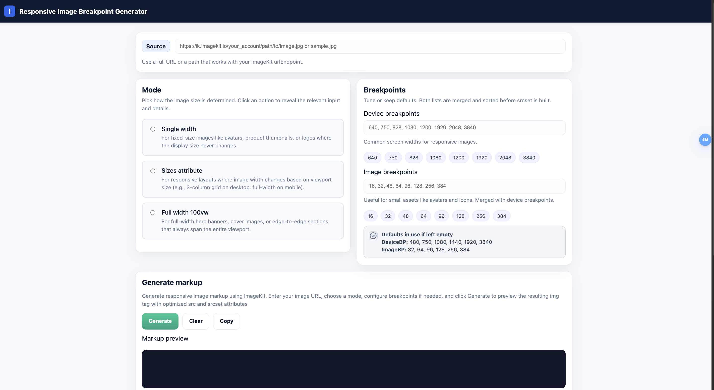

# Srcset Generator

A browser based utility to generate responsive img markup using srcset and sizes, powered by the [ImageKit JavaScript SDK](https://imagekit.io/docs/integration/javascript).

This tool helps developers quickly create correct responsive image markup without manually calculating widths or writing srcset strings by hand.

---

## Live demo

Try the tool here: [Live Demo](https://kashish-dev-101.github.io/Srcset-Generator/)

---

## Why this tool exists

Creating responsive images correctly is error prone and repetitive.  
This tool abstracts that complexity by using ImageKit’s responsive image helper and provides a simple UI to generate production ready markup.

It is especially useful for frontend developers who want to understand and apply responsive image concepts without memorizing srcset rules.

---

## Features

1. Generate responsive img markup using the ImageKit JS SDK
2. Supports multiple generation modes
   1. Single width mode
   2. Sizes attribute mode
   3. Full width mode using `sizes="100vw"`
3. Customizable breakpoints
   1. Device breakpoints for viewport widths
   2. Image breakpoints for generated image sizes
4. Live image preview
5. Copy generated markup to clipboard
6. Persistent state using localStorage
   1. Restores form values on reload
   2. Restores last generated markup

---

## How it works

1. User provides an ImageKit Image URL
2. A responsive mode is selected
3. Breakpoints are read from user input or defaults
4. ImageKit generates responsive image attributes
5. The tool renders
   1. The final img markup
   2. A live preview using the generated src and srcset

---

## Responsive modes explained

### Single width mode

Use this when the image has a fixed rendered width, such as thumbnails, avatars, or product card images.
The tool generates srcset values based on the provided width and breakpoints.

### Sizes mode

Use this when the image width changes based on viewport size, such as multi-column layouts, responsive grids, or article images that adjust width at different breakpoints.
The sizes attribute is passed directly to ImageKit for accurate srcset generation.

### Full width mode

A convenience mode that assumes the image always spans the full viewport width, such as hero banners, landing page backgrounds, or full-bleed sections.
Internally this uses `sizes="100vw"`.

---

## Breakpoints

This tool exposes two independent breakpoint configurations.

### Device breakpoints

These represent viewport widths at which the image layout may change.

Default values:  
640, 750, 828, 1080, 1200, 1920, 2048, 3840

### Image breakpoints

These represent actual image widths that ImageKit can generate.

Default values: 16, 32, 48, 64, 96, 128, 256, 384

### Fallback behavior

If the user leaves breakpoint inputs empty or provides invalid values, the tool automatically falls back to the default breakpoint arrays.

---

## Tech stack

1. Vanilla JavaScript
2. HTML and CSS
3. ImageKit JavaScript SDK

---

## Setup and usage

1. Clone the repository
2. Open index.html in a browser

For local development, any static server can be used, for example the VS Code Live Server extension.

---

## ImageKit reference

This tool uses the ImageKit JavaScript SDK for responsive image generation.

Relevant documentation:

- [ImageKit JS SDK (Responsive Images)](https://imagekit.io/docs/integration/javascript#responsive-images)
- [Responsive Images Guide](https://imagekit.io/responsive-images/)
